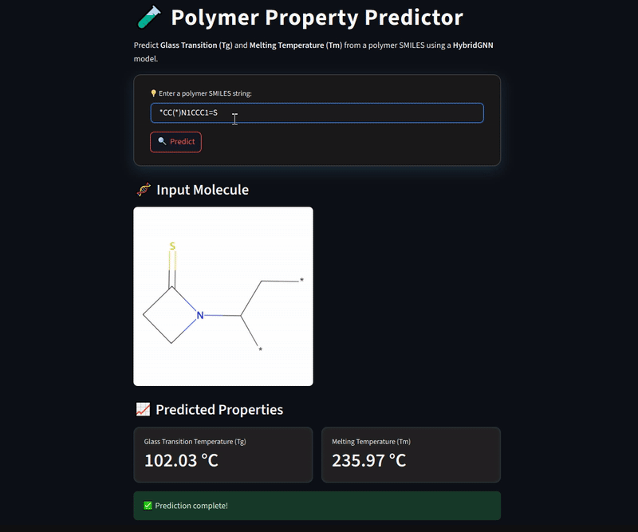

# 🧬 HybridGNN Polymer Property Predictor

This project presents a machine learning framework for the **simultaneous prediction** of two fundamental thermal properties of polymers:

- **Glass Transition Temperature (Tg)**
- **Melting Temperature (Tm)**

given their **monomer SMILES representations**.

The core model leverages a **Hybrid Graph Neural Network (HybridGNN)** architecture that combines **graph-based molecular structure** with **physicochemical descriptors** for accurate, data-driven predictions.

---

## 🎥 Demo

---

## 🎯 Motivation

Understanding and predicting the thermal properties of polymers such as the **glass transition temperature (Tg)** and **melting temperature (Tm)** is critical for the rational design of materials across industries, including **packaging**, **coatings**, **electronics**, and **aerospace**. However, conventional experimental approaches to measure these properties are often **time consuming**, **resource intensive**, and **limited in scalability**.

This project addresses these challenges by leveraging **graph-based deep learning** in combination with **chemically informed molecular descriptors**. By integrating structural graph representations with domain-specific features, the model provides a **scalable, data-driven alternative** that enables **rapid and accurate prediction** of polymer thermal behavior.

---

## 🔬 Overview

The prediction model is based on a **HybridGNN** architecture that:

- Constructs a graph representation of the monomer using atom/bond information
- Extracts RDKit-based descriptors (e.g., molecular weight, LogP, H-bond acceptors)
- Applies **Principal Component Analysis (PCA)** to reduce descriptor dimensionality
- Fuses the learned **graph embeddings** with **descriptor vectors**
- Performs **multi-target regression** to jointly predict Tg and Tm

An interactive **Streamlit-based interface** allows users to input SMILES strings and instantly visualize and predict polymer properties.

---

## 🧠 Model Architecture

The HybridGNN consists of a stack of:

- `Graph Isomorphism Network (GIN)`
- `Graph Attention Network (GAT)`
- `GraphConv` layers

These layers extract multi-scale structural information, which is then combined with compressed descriptors through fully connected layers.

---
